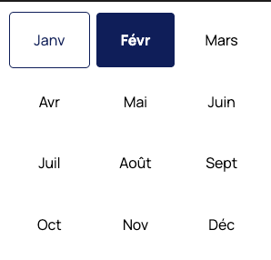
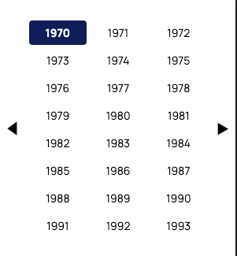
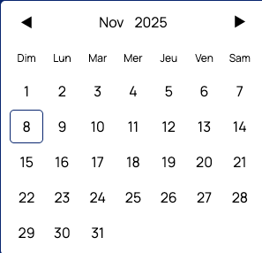

# Календарь на Vue с поддержкой языков

## Описание
Компонент календаря на Vue 3 с поддержкой нескольких языков, использующий Pinia для управления состоянием и LocalStorage для сохранения настроек.

## Стек технологий
- Vue 3 (Composition API)
- TypeScript
- Pinia
- Vite
- Sass
- ESLint + Prettier + Oxlint

## Установка
```bash
npm install
npm run dev
```

## Особенности реализации

### Навигация по датам
Добавлена возможность выбора месяца и года отдельно, что упрощает навигацию к датам далеко в прошлом или будущем.




### Валидация
- Установлена валидация на даты до 1970 года
- 

### Архитектура
Дни месяца организованы в массив недель: перед первым днём месяца добавляются пустые ячейки для корректного выравнивания по дням недели, затем идут все числа месяца, а в конце при необходимости добавляются пустые ячейки до полной недели (7 дней).

## Дизайнерские решения
Намеренно не добавлена выделенная окраска текущей даты, так как это может конфликтовать с общим дизайном. Такое выделение больше подходит для компонентов выбора периода, чем для одиночной даты.
